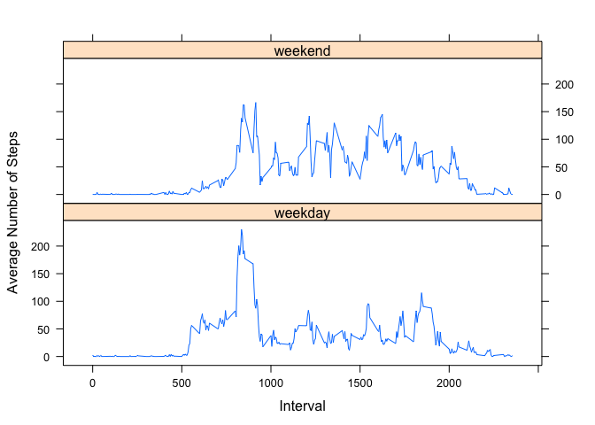

# Reproducible Research: Peer Assessment 1


## Loading and preprocessing the data

First use read.csv to read the data into a data frame, and convert the date from a factor variable to a Date variable.


```r
stepData <- read.csv("activity.csv", header=TRUE)
str(stepData)
```

```
## 'data.frame':	17568 obs. of  3 variables:
##  $ steps   : int  NA NA NA NA NA NA NA NA NA NA ...
##  $ date    : Factor w/ 61 levels "2012-10-01","2012-10-02",..: 1 1 1 1 1 1 1 1 1 1 ...
##  $ interval: int  0 5 10 15 20 25 30 35 40 45 ...
```

```r
stepData$date <- as.Date(stepData$date, format = "%Y-%m-%d")
str(stepData)
```

```
## 'data.frame':	17568 obs. of  3 variables:
##  $ steps   : int  NA NA NA NA NA NA NA NA NA NA ...
##  $ date    : Date, format: "2012-10-01" "2012-10-01" ...
##  $ interval: int  0 5 10 15 20 25 30 35 40 45 ...
```


## What is mean total number of steps taken per day?

Use the dplyr package to calculate the total number of steps for each day
and then make a histogram of the results

```r
library(dplyr)
stepsPerDay <- stepData %>% group_by(date) %>% summarise_each(funs(sum), steps)
barplot(stepsPerDay$steps, names.arg = stepsPerDay$date)
```

 

Now calculate the mean number of steps each day and the median number of steps each day.


```r
meanSteps <- mean(stepsPerDay$steps, na.rm = TRUE)
medianSteps <- median(stepsPerDay$steps, na.rm = TRUE)
```


The mean number of steps per day = 10766.19 and the median number of steps per day = 10765

## What is the average daily activity pattern?


```r
library(lattice)
intervalMeanData <- stepData %>% group_by(interval) 
intervalMeanData <- intervalMeanData %>% summarise_each(funs(mean(.,na.rm = TRUE)), steps)
xyplot(steps ~ interval, data = intervalMeanData,
         type = "l",
         xlab = "Interval",
         ylab = "Number of Steps")
```

 

```r
maxInterval <- intervalMeanData %>% top_n(steps,n=1)
maxInterval
```

```
## Source: local data frame [1 x 2]
## 
##   interval    steps
## 1      835 206.1698
```

There 5 minute interval at 835 contains the maximum number of steps (206.1698113) on average, across all the days in the dataset.

## Imputing missing values


```r
summary(stepData)
```

```
##      steps             date               interval     
##  Min.   :  0.00   Min.   :2012-10-01   Min.   :   0.0  
##  1st Qu.:  0.00   1st Qu.:2012-10-16   1st Qu.: 588.8  
##  Median :  0.00   Median :2012-10-31   Median :1177.5  
##  Mean   : 37.38   Mean   :2012-10-31   Mean   :1177.5  
##  3rd Qu.: 12.00   3rd Qu.:2012-11-15   3rd Qu.:1766.2  
##  Max.   :806.00   Max.   :2012-11-30   Max.   :2355.0  
##  NA's   :2304
```

```r
head(stepData)
```

```
##   steps       date interval
## 1    NA 2012-10-01        0
## 2    NA 2012-10-01        5
## 3    NA 2012-10-01       10
## 4    NA 2012-10-01       15
## 5    NA 2012-10-01       20
## 6    NA 2012-10-01       25
```

```r
head(intervalMeanData)
```

```
## Source: local data frame [6 x 2]
## 
##   interval     steps
## 1        0 1.7169811
## 2        5 0.3396226
## 3       10 0.1320755
## 4       15 0.1509434
## 5       20 0.0754717
## 6       25 2.0943396
```

As shown above, there are 2304 missing (NA) values in the dataset.  Each of the missing NA values will be replaced by the average for the given time interval.  The average values for each time interval are contined in the intervalMeanData dataset.


```r
modifiedStepData <- stepData
for (i in 1:nrow(modifiedStepData)){
  if (is.na(modifiedStepData$steps[i])) {
    desiredInterval <- modifiedStepData$interval[i]
    newStepsValue <- intervalMeanData$steps[intervalMeanData$interval == desiredInterval]
    modifiedStepData$steps[i] <- newStepsValue
  }
}
summary(modifiedStepData)
```

```
##      steps             date               interval     
##  Min.   :  0.00   Min.   :2012-10-01   Min.   :   0.0  
##  1st Qu.:  0.00   1st Qu.:2012-10-16   1st Qu.: 588.8  
##  Median :  0.00   Median :2012-10-31   Median :1177.5  
##  Mean   : 37.38   Mean   :2012-10-31   Mean   :1177.5  
##  3rd Qu.: 27.00   3rd Qu.:2012-11-15   3rd Qu.:1766.2  
##  Max.   :806.00   Max.   :2012-11-30   Max.   :2355.0
```

```r
head(modifiedStepData)
```

```
##       steps       date interval
## 1 1.7169811 2012-10-01        0
## 2 0.3396226 2012-10-01        5
## 3 0.1320755 2012-10-01       10
## 4 0.1509434 2012-10-01       15
## 5 0.0754717 2012-10-01       20
## 6 2.0943396 2012-10-01       25
```


```r
library(dplyr)
modifiedStepsPerDay <- modifiedStepData %>% group_by(date) %>% summarise_each(funs(sum), steps)
barplot(modifiedStepsPerDay$steps, names.arg = modifiedStepsPerDay$date)
```

 


```r
modifiedMeanSteps <- mean(modifiedStepsPerDay$steps, na.rm = TRUE)
modifiedMedianSteps <- median(modifiedStepsPerDay$steps, na.rm = TRUE)
```


After replacing all NA values with the mean value for the appropriate time interval, the mean number of steps per day = 10766.19 and the median number of steps per day = 10766.19

## Are there differences in activity patterns between weekdays and weekends?

We create a factor variable (dayType) which identifies each day as a weekday or weekend and then plot the total number of steps versus the time interval for weekdays and weekends.


```r
library(lattice)
summaryData <- stepData
summaryData$dayType <- as.factor(c("weekend","weekday","weekday","weekday","weekday","weekday","weekend")
                                 [as.POSIXlt(summaryData$date)$wday + 1])
activityPattern <- summaryData %>% group_by(dayType, interval) %>% summarise_each(funs(sum(.,na.rm = TRUE)), steps)
xyplot(steps ~ interval | dayType, data = activityPattern,
         layout = c(1,2), stack = TRUE, type = "l",
         xlab = "Interval",
         ylab = "Number of Steps")
```

 

